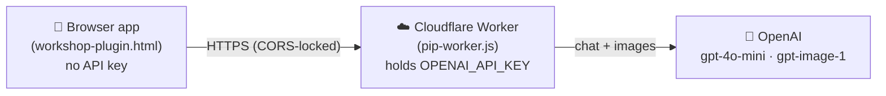

<div align="center">

# 🌱 StorySketch Workshop

**A single-file, client-side web app where kids create multi-slide illustrated stories — with Pip, a friendly AI illustrator.**

[](https://lzhangsktlab.github.io/story-sprout/)


</div>

---

## ✨ What is this?

StorySketch Workshop is a kid-friendly storybook maker that runs entirely in the browser — no install, no build step, no framework. Children describe the pictures they imagine, and **Pip**, a conversational AI illustrator, draws them right onto the canvas. They can arrange text and shapes, build a story across multiple slides, and save everything to a local folder.

It doubles as a research tool for studying how children learn to write and refine prompts (see [`RESEARCH_DATA.md`](RESEARCH_DATA.md)).

## 🎨 Features

- **🖌️ Pip, the conversational illustrator** — chat with Pip in plain language. It asks about your idea, draws it when it has enough detail, and asks *"Is this the picture you imagined?"* so kids reflect and refine. Place a revision **side-by-side** with the old one to compare, and tell Pip to remove the one you don't want.
- **🤖 AI Image drawer** — a more direct generate/modify panel (style + quality controls) powered by OpenAI.
- **🧩 Canvas editor** — text boxes, shapes, and images on a Fabric.js canvas with move/scale/rotate, layering, and alignment.
- **📚 Multi-slide stories** — build a picture book one slide at a time, with thumbnails.
- **↩️ Undo / redo** — per-slide history (up to 50 steps).
- **💾 Local-first saving** — saves `story.json` + image files to a folder you pick (File System Access API); auto-saves every few seconds.
- **🔒 Safe by design** — Pip is scoped to illustration only, with content guardrails appropriate for young children.

## 🏗️ Architecture

The browser app never holds any API keys. All AI calls go through a small **Cloudflare Worker** that keeps the OpenAI key server-side.



- **Frontend:** one HTML file (inline CSS + JS), served as static files (GitHub Pages or opened locally).
- **Backend:** a Cloudflare Worker proxy — the only place the API key lives. Adds CORS lock-down, a gentle anti-spam rate limit, and child-safety guardrails.

## 📂 Project structure

| Path | What it is |
|---|---|
| `index.html` | Entry point — redirects to the current app |
| `workshop-plugin.html` | **The app** (Pip + OpenAI drawer) — current version |
| `workshop.html` | Earlier version (direct Stability AI) — legacy |
| `cloudflare-worker/pip-worker.js` | **OpenAI proxy** for Pip + the image drawer |
| `cloudflare-worker/worker.js` | Legacy Stability AI proxy |
| `PIP_SCOPE.md` | Pip's behavior specification (source of truth) |
| `RESEARCH_DATA.md` | Schema for the data captured for prompt-writing research |
| `STYLE_CONSISTENCY.md` | Notes on keeping art style consistent across a story |
| `scripts/images-to-json.py` | Convert a folder of images into a workshop story JSON |
| `CLAUDE.md` | Guidance for AI coding assistants working in this repo |

## 🚀 Getting started

### Just use it
Open the **[live demo](https://lzhangsktlab.github.io/story-sprout/)** in a modern browser (Chrome/Edge 86+ recommended for folder saving).

### Run locally
No build tools or dependencies — just open the file:

```bash
# clone, then open the app
open workshop-plugin.html          # macOS
start workshop-plugin.html         # Windows
```

> 💡 Some features (folder save via the File System Access API) need a Chromium-based browser. Opening over `http://localhost` or directly via `file://` both work for AI calls, since the worker's CORS allowlist includes them.

## 🔧 Deploying your own

### 1. Frontend (GitHub Pages)
Enable Pages on the `main` branch (root). `index.html` redirects visitors to `workshop-plugin.html`.

### 2. Backend (Cloudflare Worker)
1. Create a Worker (e.g. `storysprout-pip`) and paste in `cloudflare-worker/pip-worker.js`.
2. Add your key as an **encrypted secret** named `OPENAI_API_KEY` (Settings → Variables and Secrets).
3. Point the app at your Worker by setting `PIP_PROXY_URL` near the top of the Pip section in `workshop-plugin.html`.
4. Lock it down: add your site's origin to `ALLOWED_ORIGINS` in the Worker, and set a **monthly spend limit** in your OpenAI account as the financial backstop.

The Worker exposes:

| Route | Purpose |
|---|---|
| `POST /chat` | Pip's conversational turn (`{ reply, ready, image_prompt, remove_old }`) |
| `POST /image` | Text-to-image generation |
| `POST /image-edit` | Image-to-image revision |

## ⌨️ Keyboard shortcuts

| Shortcut | Action |
|---|---|
| `Ctrl/Cmd + Z` | Undo |
| `Ctrl/Cmd + Y` or `Ctrl/Cmd + Shift + Z` | Redo |
| `Ctrl/Cmd + S` | Save |
| `Ctrl/Cmd + D` | Duplicate |
| `Delete` / `Backspace` | Delete selected |

## 🧰 Tech stack

- **[Fabric.js 5.3.1](http://fabricjs.com/)** — canvas objects, serialization
- **[OpenAI](https://platform.openai.com/)** — `gpt-4o-mini` (chat) + `gpt-image-1` (images)
- **[Cloudflare Workers](https://workers.cloudflare.com/)** — key-safe API proxy
- **Vanilla JS + HTML + CSS** — no framework, no build
- **Nunito** (Google Fonts)

## 🔐 Privacy & safety

- No accounts, no logins — story data stays on the child's device.
- API keys never reach the browser; they live only in the Cloudflare Worker.
- Pip is constrained to age-appropriate illustration with content and prompt-injection guardrails.
- Research data (if used) is anonymized and stored only in the local story file — see [`RESEARCH_DATA.md`](RESEARCH_DATA.md).

---

<div align="center">
<sub>Built for curious kids and the researchers who study how they learn. 🌱</sub>
</div>
