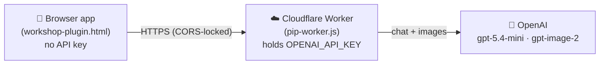
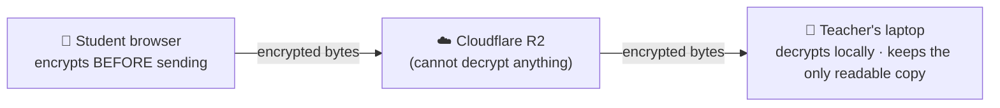

<div align="center">

# 🌱 StorySprout Studio

**A single-file, client-side web app where kids create multi-slide illustrated stories — with Pip, a friendly AI illustrator.**

[](https://lzhangsktlab.github.io/story-sprout/workshop-plugin.html)
[](https://lzhangsktlab.github.io/story-sprout/teacher.html)


</div>

---

## ✨ What is this?

StorySprout Studio is a kid-friendly storybook maker that runs entirely in the browser — no install, no build step, no framework. Children describe the pictures they imagine, and **Pip**, a conversational AI illustrator, draws them right onto the canvas. They can arrange text and shapes, build a story across multiple slides, and save everything to a local folder.

It doubles as a research tool for studying how children learn to **describe and refine their scenes** — they never write the prompt themselves; they describe a picture and Pip composes it (see [`RESEARCH_DATA.md`](RESEARCH_DATA.md)).

## 🎨 Features

- **🖌️ Pip, the conversational illustrator** — chat with Pip in plain language. It asks about your idea, draws it when it has enough detail, and asks *"Is this the picture you imagined?"* so kids reflect and refine. Place a revision **side-by-side** with the old one to compare, and tell Pip to remove the one you don't want.
- **🧩 Canvas editor** — text boxes, shapes, and images on a Fabric.js canvas with move/scale/rotate, layering, and alignment.
- **📚 Multi-slide stories** — build a picture book one slide at a time, with thumbnails.
- **↩️ Undo / redo** — per-slide history (up to 50 steps).
- **💾 Local-first saving** — saves `story.json` + image files to a folder you pick (File System Access API); auto-saves every few seconds.
- **🍎 Teacher Mode** — a teacher can collect every child's work onto their own computer, automatically. Children never make accounts. See below.
- **🔒 Safe by design** — Pip is scoped to illustration only, with content guardrails appropriate for young children.

## 🏗️ Architecture

The browser app never holds any API keys. All AI calls go through a small **Cloudflare Worker** that keeps the OpenAI key server-side.



- **Frontend:** one HTML file (inline CSS + JS), served as static files (GitHub Pages or opened locally).
- **Backend:** a Cloudflare Worker proxy — the only place the API key lives. Adds CORS lock-down, a gentle anti-spam rate limit, and child-safety guardrails.

## 🔬 Research artifacts

This repo is also the artifact for a study of **how agency is split between the child and the model** — in particular Pip's *scribe* behaviour: does the picture prompt carry the child's own words, typos and all, or does the model quietly rewrite them?

**Paper:** _(link TBD — not yet public)_ · background: [`PAPER_REFERENCE.md`](PAPER_REFERENCE.md).

Pip's chat **contract** (the `PIP_SYSTEM` prompt in `pip-worker.js`) and its **model** were chosen by a reproducible audit whose inputs and outputs are committed here, not summarized away:

| Path | What it is |
|---|---|
| `scribe_audit.py`, `scribe_audit_ext.py` | v1 harness (2-turn sequences) and its 200-turn extension |
| `scribe_audit_v2.py` | development suite — 50 four-turn sequences, used for **model selection** |
| `scribe_audit_v3_heldout.py` | **held-out verification** harness — 60 all-new sequences, frozen config, `--rescore` mode |
| `CLAUDE_CODE_AUDIT_V3_HELDOUT_INSTRUCTIONS.md` | the researcher-authored spec that drove the held-out run (freeze gate, one-function rule, packaging) |
| `model_selection_tests/` | the eight archived selection runs (+ its own `README.md`) |
| `scribe_audit_v3_heldout_out/` | the verification run — 3 reps × {original, re-scored, pass-1} + `run_config.json` + `PROTOCOL.md` |
| `tests/` | **over-delivery audit** — does the renderer draw things nobody asked for, and do the three content levels hold? Design + a 20-image pilot. Full run not yet authorised. |

**Frozen final numbers** — held-out suite, `gpt-5.4-mini` at `reasoning_effort: low`, against the frozen contract (`PIP_SYSTEM` sha256 `d01f624b…`), 60 unseen four-turn sequences × 3 stochastic reps:

| Measure | Result |
|---|---|
| Verbatim (every seeded typo survives) | **240 / 240** ×3 |
| Unrequested additions flagged | **0 / 720** |
| Supplied detail omitted flagged | **7 / 720** (all one disclosed sequence, H56) |
| Interaction rules (draw/ask/removal/compliment) | **84 / 84** |

The deterministic scorer flags *candidates*; flagged lines are adjudicated on the paper side. After the run, two ruler bugs were fixed and **everything re-scored deterministically from the stored transcripts** — no new model calls. Reproduce that pass offline:

```bash
python3 scribe_audit_v3_heldout.py --rescore
```

> The audit **selected** `gpt-5.4-mini`; the public demo currently still runs the previous chat model pending a redeploy of the Worker.

## 🍎 Teacher Mode

A teacher signs in at [`teacher.html`](https://lzhangsktlab.github.io/story-sprout/teacher.html), creates a **team** for each classroom computer, and gets back a team name and a secret code to tape to that machine. Children enter it once. From then on their work flows back to the teacher's laptop — every few minutes, and on demand.

**Children never create accounts.** A team identifies a *computer*, not a person.

### The relay is a dead-drop, not a database

A browser cannot reach into another computer, so the two machines need something in between. That something stores **only ciphertext it cannot read**:



The team's secret code is run through PBKDF2, then split by HKDF into three separate keys:

| Key | Where it goes |
|---|---|
| **encryption key** | Never leaves the browser. |
| **auth token** | Sent to the relay to prove team membership. Cannot be reversed into the encryption key. |
| **blob key** | HMACs image IDs, so listing the bucket can't reveal *which* images a team holds, or that two teams share one. |

The teacher and the student each derive all three from `(team name, secret code)` alone — **no key is ever exchanged.** The only readable copy of a child's story exists on the teacher's disk.

> **Be honest about the limit:** the secret code *is* the security model. A generated code is solid against a curious classmate; it is not solid against a determined attacker holding the ciphertext, because no iteration count fixes a small search space. Codes are always **generated, never chosen**. Guessing one still cannot *read* a story — but it could *overwrite* one, which is why the relay keeps the last 30 revisions.

### Stories are 50MB. Syncs are 1.5KB.

Every AI image is base64-inlined into each slide *and* duplicated in the history, so a six-page story runs ~50MB. Re-uploading that every five minutes, per device, over school wifi would be hopeless.

So images are **content-addressed**: each one is hashed, uploaded exactly once, and referenced by hash thereafter. The recurring payload is just the story skeleton — gzipped and encrypted, **about 1.5KB**, or ~4,000× smaller. On the teacher's disk, images live in one shared folder, so a snapshot every five minutes costs kilobytes rather than gigabytes.

### What lands on the teacher's disk

```
Class folder/
├── teacher.json          ← teams + secret codes.  ⚠ This is the master key. Lose it and the work is unrecoverable.
├── class.json            ← index of every team's work
├── images/<hash>.png     ← decrypted, shared across all teams and snapshots
└── teams/brave-otter/
    ├── latest.json       ← the full story — opens directly in workshop-plugin.html
    └── snapshots/…       ← dated history of how the story grew
```

### Setting it up

**Cloudflare** (same Worker as Pip — the sync routes live alongside `/chat` and `/image`):
1. **R2 → Create bucket**, then **Worker → Settings → Bindings → R2 bucket**, variable name `SPROUT_BUCKET`.
2. Add a secret `TEACHER_PASSPHRASE` — long and random. This is the fallback sign-in.
3. *(Optional, for Google sign-in)* add plain vars `GOOGLE_CLIENT_ID` and `ALLOWED_TEACHER_EMAILS`.

**Google sign-in** (optional — the passphrase alone works fine): create an OAuth **Web application** client in Google Cloud. Authorized JavaScript origins must include `https://<you>.github.io` **and** `http://localhost:8000`; leave redirect URIs empty. Paste the client ID into `GOOGLE_CLIENT_ID` in `teacher.html` (client IDs are public — safe to commit).

**Requires Chrome or Edge.** Saving to a folder needs the File System Access API, which Firefox and Safari do not implement. When Chrome asks about the folder, choose **"Allow on every visit"** or it will re-prompt every session.

> ⚠️ **`sprout-sync.js` is shared byte-for-byte by both pages.** If you change any crypto constant in it, bump `VERSION`, both pages' `REQUIRE_SYNC_VERSION`, *and* the `?v=` on both `<script>` tags — together. A stale cached copy on one page would derive different keys and fail **silently**: uploads succeed, collection succeeds, and the stories simply never open. Both pages assert the version on boot and refuse to sync on a mismatch, which turns that into a loud, fixable error instead of quiet data loss.

## 📂 Project structure

| Path | What it is |
|---|---|
| `index.html` | Entry point — redirects to the current app |
| `workshop-plugin.html` | **The app** — Pip, the conversational illustrator |
| `teacher.html` | **Teacher Mode dashboard** — create teams, collect student work |
| `sprout-sync.js` | Shared crypto + content-addressing + relay client (used by **both** pages) |
| `sprout-sync-test.html` | Test harness for the above — open it and click *Run tests* |
| `cloudflare-worker/pip-worker.js` | **OpenAI proxy** for Pip **and** the sync relay |
| `cloudflare-worker/pip-worker.js` | **Pip's behavior spec is the `PIP_SYSTEM` prompt in here** — the source of truth |
| `PIP_SCOPE.md` | Phase 1 design record. Historical; superseded by `PIP_SYSTEM` |
| `RESEARCH_DATA.md` | Codebook for the local story-file schema (`childWords` vs. the composed prompt; v6) |
| `scripts/images-to-json.py` | Convert a folder of images into a story JSON |
| `tests/` | Over-delivery audit: `TEST_PLAN.md`, `PROTOCOL.md`, `CODEBOOK.md`, stimuli, pilot results and images |
| `CLAUDE.md` | Guidance for AI coding assistants working in this repo |

## 🚀 Getting started

### Just use it
Open the **[live demo](https://lzhangsktlab.github.io/story-sprout/)** in a modern browser (Chrome/Edge 86+ recommended for folder saving).

### Run locally
No build tools or dependencies — just open the file:

```bash
# clone, then open the app
open workshop-plugin.html          # macOS
start workshop-plugin.html         # Windows
```

> 💡 Some features (folder save via the File System Access API) need a Chromium-based browser. Opening over `http://localhost` or directly via `file://` both work for AI calls, since the worker's CORS allowlist includes them.

## 🔧 Deploying your own

### 1. Frontend (GitHub Pages)
Enable Pages on the `main` branch (root). `index.html` redirects visitors to `workshop-plugin.html`.

### 2. Backend (Cloudflare Worker)
1. Create a Worker (e.g. `storysprout-pip`) and paste in `cloudflare-worker/pip-worker.js`.
2. Add your key as an **encrypted secret** named `OPENAI_API_KEY` (Settings → Variables and Secrets).
3. Point the app at your Worker by setting `PIP_PROXY_URL` near the top of the Pip section in `workshop-plugin.html`.
4. Lock it down: add your site's origin to `ALLOWED_ORIGINS` in the Worker, and set a **monthly spend limit** in your OpenAI account as the financial backstop.

The Worker exposes:

| Route | Purpose |
|---|---|
| `POST /chat` | Pip's conversational turn (`{ reply, ready, image_prompt, remove_old }`) |
| `POST /image` | Text-to-image generation |
| `POST /image-edit` | Image-to-image revision |
| `POST /sync/register` | Teacher only — creates a team. The one gate stopping the relay being open storage. |
| `GET /sync/state` | Cheap poll: `{ rev, updatedAt }`. The teacher only downloads when `rev` moves. |
| `GET · PUT /sync/manifest` | The encrypted story. `PUT` is compare-and-set on a **server-assigned** revision — student clocks are never trusted. |
| `POST /sync/blobs/check` | `{ ids[] } → { missing[] }`, so a routine sync is two requests, not twenty |
| `GET · PUT /sync/blob/<id>` | An encrypted image. Immutable, content-addressed. |
| `GET · PUT /sync/assign` | The teacher's assignment — its own object, so it can't race a student's push |

## ⌨️ Keyboard shortcuts

| Shortcut | Action |
|---|---|
| `Ctrl/Cmd + Z` | Undo |
| `Ctrl/Cmd + Y` or `Ctrl/Cmd + Shift + Z` | Redo |
| `Ctrl/Cmd + S` | Save |
| `Ctrl/Cmd + D` | Duplicate |
| `Delete` / `Backspace` | Delete selected |

## 🧰 Tech stack

- **[Fabric.js 5.3.1](http://fabricjs.com/)** — canvas objects, serialization
- **[OpenAI](https://platform.openai.com/)** — `gpt-5.4-mini` (chat) + `gpt-image-2` (images)
- **[Cloudflare Workers](https://workers.cloudflare.com/)** — key-safe API proxy + zero-knowledge sync relay
- **[Cloudflare R2](https://developers.cloudflare.com/r2/)** — encrypted blob storage for Teacher Mode
- **WebCrypto** — PBKDF2 → HKDF → AES-GCM, all in the browser
- **Vanilla JS + HTML + CSS** — no framework, no build
- **Nunito** (Google Fonts)

## 🔐 Privacy & safety

- **Children never have accounts.** No logins, no names, no email. A team identifies a *computer*, not a person. Only the teacher signs in.
- **Without Teacher Mode, nothing leaves the device** — story data is local, full stop.
- **With Teacher Mode, only ciphertext leaves the device.** Work is encrypted in the child's browser before it is sent; the relay stores bytes it holds no key to open, and they expire. The only readable copy lives on the teacher's own computer.
- API keys never reach the browser; they live only in the Cloudflare Worker.
- Pip is constrained to age-appropriate illustration with content and prompt-injection guardrails.
- **No child data is collected by the platform.** The story file is a **local** file — on the child's device, or synced encrypted to the supervising teacher's computer in class mode. Nothing is transmitted to or retained by a research server. Any analysis happens only on files consenting families **voluntarily contribute** under an ethics protocol — [`RESEARCH_DATA.md`](RESEARCH_DATA.md) is the codebook for reading such a file.

**Two things not to be coy about:**
- `teacher.json` holds every team's secret code in plaintext on the teacher's disk. It has to — those codes *are* the decryption keys. **Losing that file means losing the class's work irrecoverably**, and no one can recover it for you; that is what zero-knowledge means. Keep it off shared drives.
- A team's secret code protects that team's work. It is generated with real entropy and never chosen by a child, but it is still a short human-typeable string. It is proof against a curious classmate, not against a determined attacker who already holds the ciphertext.

## 📄 License

[MIT](LICENSE) — non-commercial research project, released as-is. The MIT terms include the standard warranty disclaimer and limitation of liability.

---

<div align="center">
<sub>Built for curious kids and the researchers who study how they learn. 🌱</sub>
</div>
